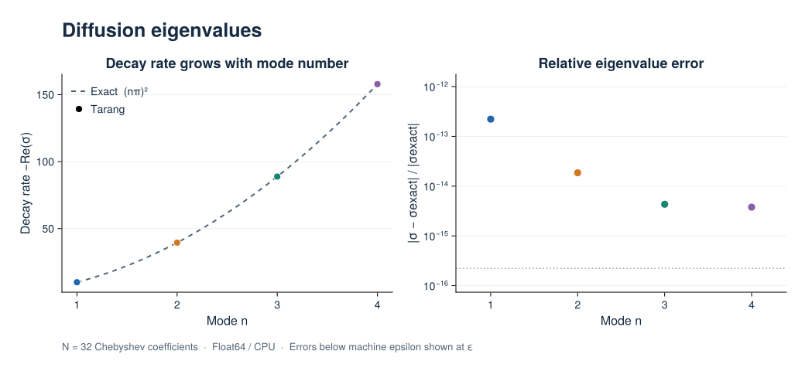
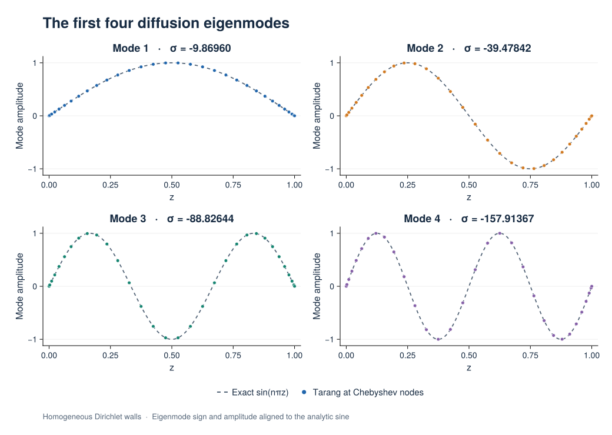

# Eigenvalue Problems

Use `EigenvalueProblem` and `EigenvalueSolver` to compute growth rates and modes
of a linear system. Nonlinear equations must first be linearized about a chosen
base state; constructing an EVP does not perform that stability linearization.

## Eigenvalue convention

For a mode ``X(t)=x e^{\sigma t}``, the equation
``M\partial_t X+LX=0`` becomes ``\sigma Mx+Lx=0``. Keep `dt(u)` in the equation
to assemble the mass matrix; the solver substitutes the eigenvalue for the
time derivative. A positive real part of ``\sigma`` means growth.

Boundary conditions for perturbations are homogeneous. Inhomogeneous physical
boundary data belongs to the base-state problem. Tau unknowns enforce bounded
constraints, whose mass-matrix rows are zero. Nonfinite generalized eigenvalues
associated with algebraic constraints are excluded from returned finite modes.

## Example: diffusion modes

For ``\partial_t u=\partial_z^2u`` on ``[0,1]`` with homogeneous Dirichlet walls,
the growth rates are ``\sigma_n=-(n\pi)^2``. This serial CPU example checks the
four slowest-decaying modes.

```julia
using Tarang

coords = CartesianCoordinates("z")
dist = Distributor(coords; dtype=Float64, device=CPU())
zb = ChebyshevT(coords["z"]; size=32, bounds=(0.0, 1.0))
domain = Domain(dist, (zb,))
u = ScalarField(domain, "u")
tau1 = ScalarField(dist, "tau1", (), Float64)
tau2 = ScalarField(dist, "tau2", (), Float64)
lift_basis = derivative_basis(zb, 2)

problem = EigenvalueProblem([u, tau1, tau2]; eigenvalue=:σ)
add_parameters!(problem; l1=lift(tau1, lift_basis, -1),
                         l2=lift(tau2, lift_basis, -2))
add_equation!(problem, "dt(u) - Δ(u) + l1 + l2 = 0")
add_bc!(problem, "u(z=0) = 0")
add_bc!(problem, "u(z=1) = 0")
solver = EigenvalueSolver(problem; nev=4, which=:SM)
eigenvalues, eigenvectors = solve!(solver)

@assert length(eigenvalues) == 4
@assert maximum(abs, imag.(eigenvalues)) < 1e-8
@assert isapprox(sort(real.(eigenvalues); rev=true), -(π .* (1:4)).^2; rtol=1e-6)
```

## Computed spectrum and eigenmodes

The figures below run the example above with 32 Chebyshev coefficients on the
CPU in `Float64`. Diffusion with homogeneous Dirichlet boundaries is a standard
EVP benchmark: both the decay rates and eigenfunctions are known analytically.
In this run, the largest relative eigenvalue error was ``2.22\times10^{-13}``
and the largest grid-point eigenfunction error was ``3.18\times10^{-14}``.
Roundoff-level results can vary with Julia and the linear algebra backend.



The decay rates are ``-\operatorname{Re}\sigma_n=(n\pi)^2``. The error panel
compares the computed eigenvalues with these exact values; errors smaller than
machine epsilon are displayed at epsilon.

[Spectrum PNG](../assets/figures/eigenvalue/diffusion_spectrum.png) ·
[Spectrum SVG](../assets/figures/eigenvalue/diffusion_spectrum.svg) ·
[Eigenvalues and error measurements (CSV)](../assets/figures/eigenvalue/diffusion_modes.csv)



Dots show eigenvectors reconstructed on the Chebyshev grid; dashed curves show
``\sin(n\pi z)``. Each eigenvector has an arbitrary sign and amplitude, aligned
here by a least-squares fit to the analytic function. No spatial rescaling is
applied.

[Eigenmodes PNG](../assets/figures/eigenvalue/diffusion_eigenmodes.png) ·
[Eigenmodes SVG](../assets/figures/eigenvalue/diffusion_eigenmodes.svg) ·
[Computed profiles (CSV)](../assets/figures/eigenvalue/diffusion_profiles.csv)

### Reproduce the figures

From the repository root, install the optional CairoMakie environment and run
the generator:

```bash
julia --project=docs/figures -e 'using Pkg; Pkg.develop(path="."); Pkg.instantiate()'
julia --project=docs/figures docs/figures/eigenvalue.jl
```

The script executes this page's Julia example, checks the eigenvalues,
reconstructed eigenfunctions, wall values, and generalized matrix residuals,
then writes SVG, PNG, and CSV files to `docs/src/assets/figures/eigenvalue/`.
The normal documentation build uses these saved assets and does not require
CairoMakie.

## Selecting and interpreting modes

`nev` selects the number of modes. `which=:SM` selects smallest magnitude;
`:LR` selects largest real part, useful for growth-rate searches. A `target`
selects nearby eigenvalues. Check spectra under resolution refinement to
separate converged physical modes from discretization artifacts.

Eigenvectors are returned as stacked coefficient columns for a single active
subproblem. With multiple Fourier-mode subproblems, the solver pools eigenvalues
and returns an empty eigenvector matrix. See
[extracting eigenmodes](../tutorials/eigenvalue_problems.md#Extracting-Eigenmodes)
for the storage convention. GPU eigenvalue solves are currently unsupported.

## Further reading

- [Stability analysis tutorial](../tutorials/eigenvalue_problems.md): base profiles and hydrodynamic examples.
- [Linear BVPs](linear_boundary_value.md) and [nonlinear BVPs](nonlinear_boundary_value.md): steady base-state calculations.
- [Tau method](../pages/tau_method.md): algebraic constraint rows and lift representation.
- [Eigenvalue solver reference](../pages/solvers.md#EigenvalueSolver): selection options and return values.
