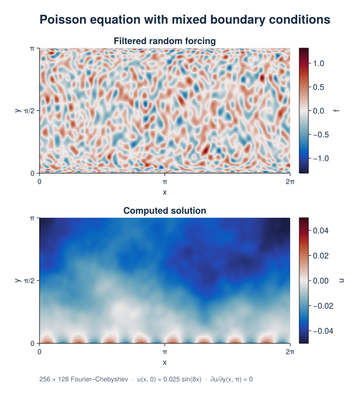

# 2D Poisson Equation

This example solves Poisson's equation with mixed boundary conditions using
filtered random forcing on a periodic strip and produces a
solution heatmap. Start with the [linear BVP guide](../problems/linear_boundary_value.md)
for the basic solver setup.

## Formulation

On ``0\le x<2\pi``, ``0\le y\le\pi``, solve

```math
\partial_x^2 u+\partial_y^2u=f(x,y),\qquad
u(x,0)=0.025\sin(8x),\qquad \partial_yu(x,\pi)=0.
```

The discretization has 256 Fourier grid points and 128 Chebyshev coefficients.
Two tau fields retain the Fourier basis and jointly enforce the two wall
conditions. Tarang evaluates the spatial Dirichlet expression on the wall.

The forcing uses seed 40, with Fourier bandwidth corresponding to 64 grid points
and Chebyshev degrees 0 through 31. Tarang's `low_pass_filter!` filters Fourier
axes, so the script truncates the Chebyshev coefficients explicitly.

## Computed solution



The lower wall imposes the sinusoidal pattern; the interior solution is smoother
than the forcing. This CPU `Float64` run has a maximum unaugmented PDE residual
``\max|\Delta u-f|\approx1.1\times10^{-9}``. The Dirichlet and Neumann errors
are below ``4\times10^{-13}``. The script checks both the PDE and the walls.

[PNG](../assets/figures/bvp/poisson.png) ·
[SVG](../assets/figures/bvp/poisson.svg) ·
[Fields and residuals (CSV)](../assets/figures/bvp/poisson_fields.csv) ·
[Julia script](../assets/figures/bvp/poisson.jl)

## Run the example

From the repository root:

```bash
julia --project examples/bvp/poisson.jl
```

### Reproduce the figures

The optional CairoMakie environment generates both BVP figures and their data
downloads. The documentation build uses the saved assets.

```bash
julia --project=docs/figures -e 'using Pkg; Pkg.develop(path="."); Pkg.instantiate()'
julia --project=docs/figures docs/figures/boundary_value.jl
```

## Complete script

```@eval
using Markdown, Tarang
source = read(joinpath(dirname(pathof(Tarang)), "..", "examples", "bvp", "poisson.jl"), String)
Markdown.MD([Markdown.Code("julia", source)])
```
