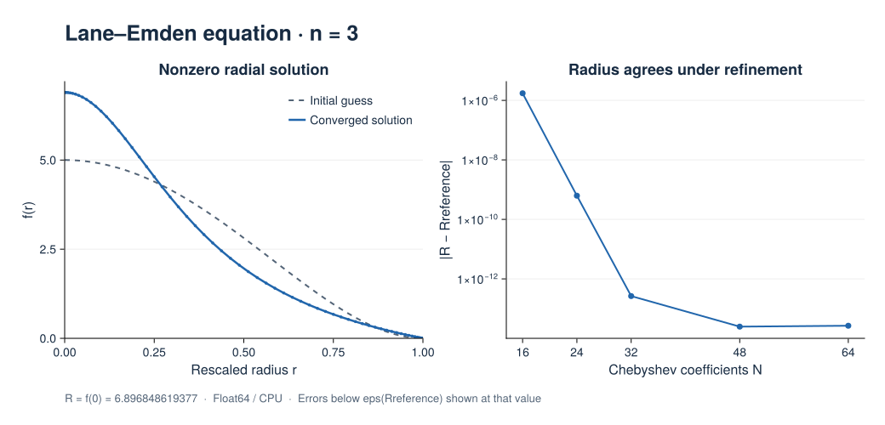

# Lane–Emden Equation

The Lane–Emden equation describes a spherically symmetric polytropic fluid.
This example follows the
[nonlinear BVP guide](../problems/nonlinear_boundary_value.md) with a physical
problem whose nonzero solution needs a full Newton Jacobian.

## Radial formulation

For polytropic index ``n=3``, the normalized Lane–Emden equation is

```math
\theta''(\xi)+\frac{2}{\xi}\theta'(\xi)+\theta(\xi)^3=0,
\qquad \theta(0)=1,\quad \theta'(0)=0.
```

Its first zero ``R`` is unknown. Set ``r=\xi/R`` and
``f(r)=R\theta(Rr)`` to obtain a problem on a fixed unit interval:

```math
rf''+2f'=-rf^3,\qquad f'(0)=0,\quad f(1)=0.
```

For this index, ``R=f(0)``. The benchmark radius is
``R\approx6.896848619376960375454528``. See
[Boyd (2011), *Chebyshev Spectral Methods and the Lane-Emden Problem*](https://doi.org/10.4208/NMTMA.2011.42S.2)
for the spectral formulation and reference calculations.

This script treats ``r`` as a one-dimensional
coordinate, includes the radial terms explicitly, and imposes ``f'(0)=0``.
Multiplying by ``r`` removes division at the origin. The script also checks
the limiting equation ``3f''(0)+f(0)^3=0``.

Two Chebyshev tau unknowns enforce the endpoint conditions of this interval formulation.

## Solution and refinement

Newton iteration starts from ``f_0(r)=5(1-r^2)^2``.
The equation also admits the trivial solution ``f=0``; the reference-radius
check ensures that the intended nonzero branch was found.



The left panel uses 64 Chebyshev coefficients with dealiasing factor 2 on the
CPU in `Float64`. It recovers ``R=6.896848619377``. The right panel varies the
resolution while retaining the same initial guess. Radius errors reach the
roundoff range; errors below `eps(Rreference)` are displayed at that value.
The CSV retains the measured values without this plotting floor.

The default run checks the radius, weighted radial residual, central limiting
equation, boundary values, and positivity. Coarse refinement runs report their
errors without applying the fine-resolution accuracy thresholds. These results
verify this radial problem; they do not establish general spherical-domain support.

[PNG](../assets/figures/bvp/lane_emden.png) ·
[SVG](../assets/figures/bvp/lane_emden.svg) ·
[Profiles (CSV)](../assets/figures/bvp/lane_emden_profiles.csv) ·
[Refinement data (CSV)](../assets/figures/bvp/lane_emden_refinement.csv) ·
[Julia script](../assets/figures/bvp/lane_emden.jl)

## Run the example

From the repository root:

```bash
julia --project examples/bvp/lane_emden.jl
```

Use the shared [CairoMakie commands](lbvp_2d_poisson.md#Reproduce-the-figures)
to reproduce the figure and refinement study.

## Complete script

```@eval
using Markdown, Tarang
source = read(joinpath(dirname(pathof(Tarang)), "..", "examples", "bvp", "lane_emden.jl"), String)
Markdown.MD([Markdown.Code("julia", source)])
```
